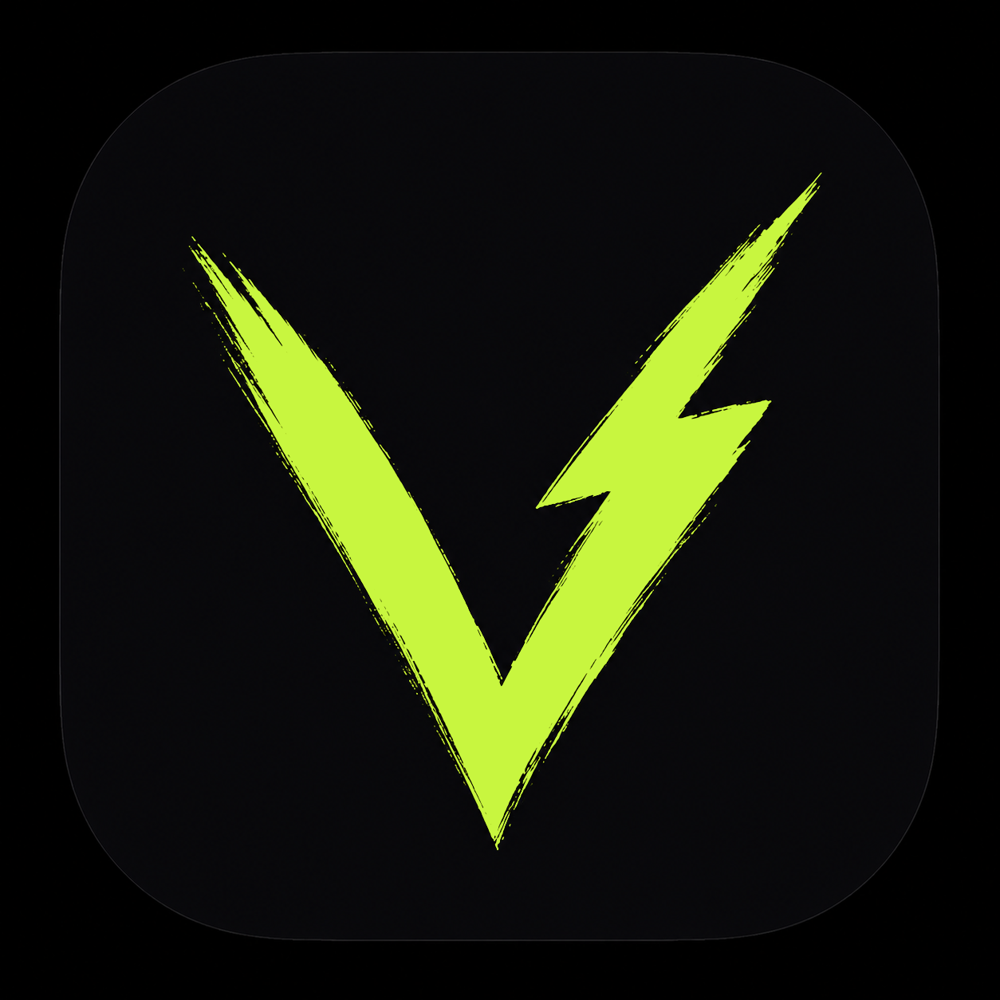
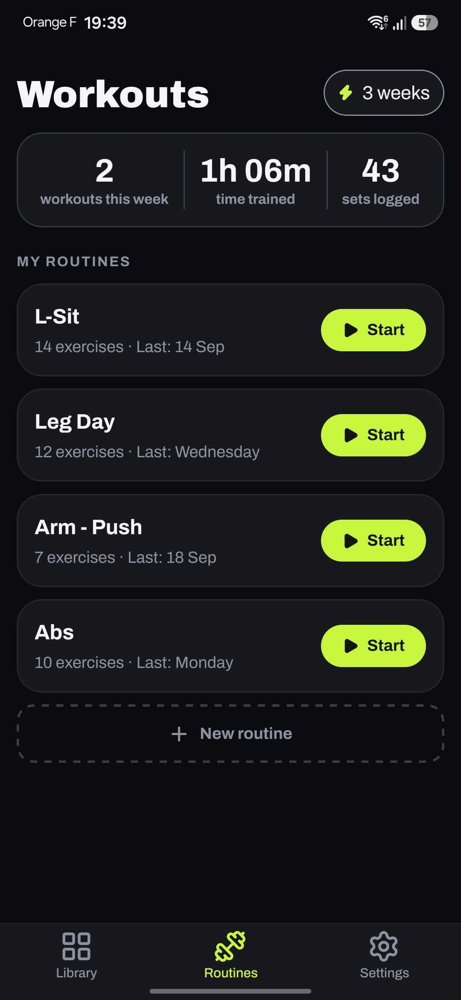
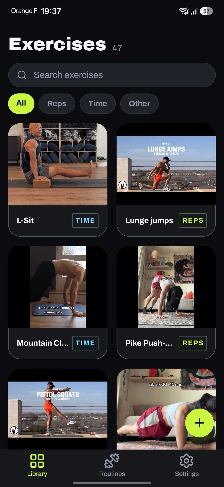
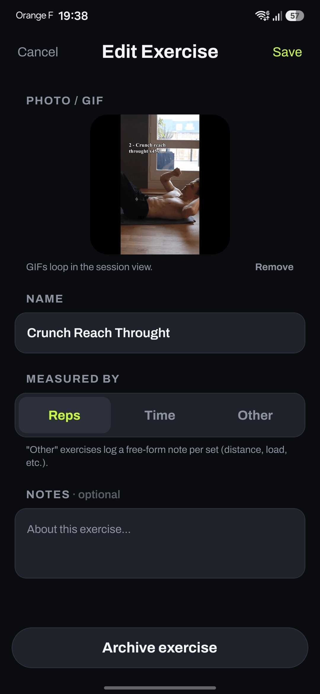
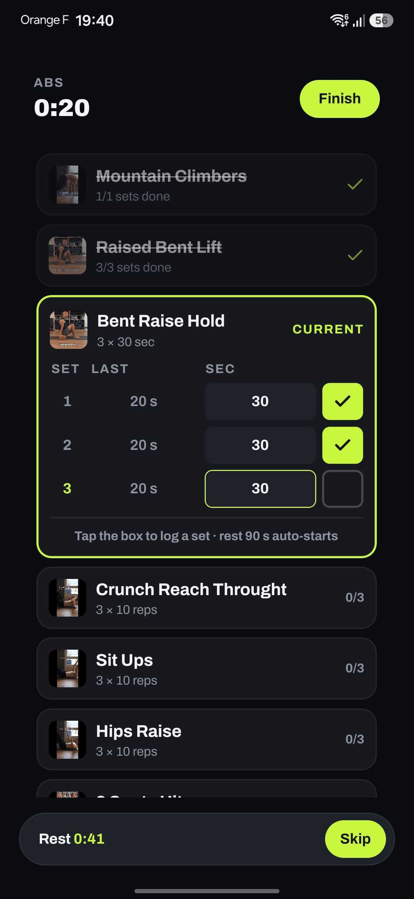
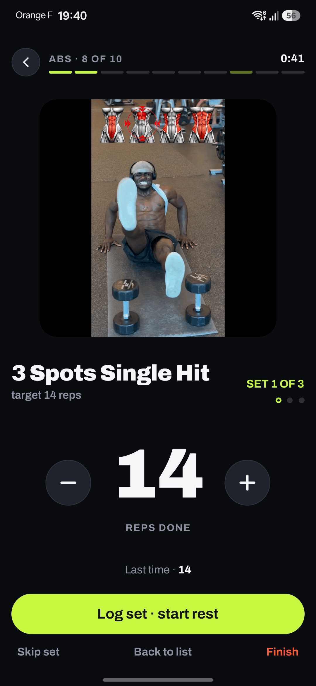
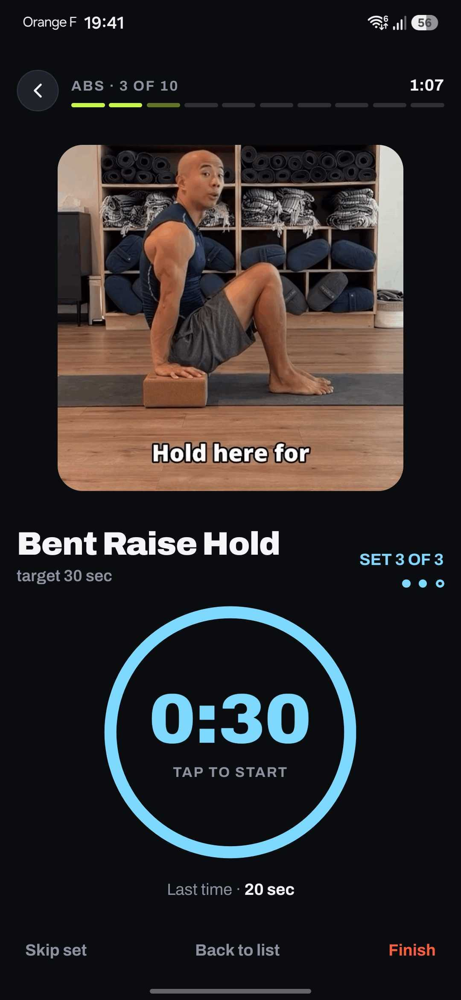

<p align="center">
  
</p>

# Volt

<!-- coverage-badge:start -->


<!-- coverage-badge:end -->


Personal workout tracker for Android. Offline, no account, no backend,
everything lives in a SQLite database on the phone.

Build routines from your own exercise library, run them with a set-by-set
checklist, rest timer and last-session ghost values, and keep a crash-safe log
of every set.

## Screenshots

<p align="center">
  
  
  
</p>
<p align="center">
  
  
  
</p>

## Features

- **Exercise library**: exercises measured by reps, time or a free-form note,
  with a photo, GIF or short video demo. Search and type filters, per-exercise
  rest override, archive and restore.
- **Routines**: pick exercises from the library, drag to reorder, set targets
  (sets × reps or seconds, optional weight in kg). Detail view with estimated
  duration and last performed.
- **Sessions**: one card per exercise, rep stepper and hold-timer focus views.
  Rest timer with skip and ghost values from the previous session.
- **Crash-safe**: every set is written to the database the moment it is logged,
  an unfinished session shows a Resume bar on Home.
- **Session comfort**: keep screen awake, timer sounds and haptics, local
  notification when rest ends, back-button confirmation before leaving a
  workout.
- **Summary & stats**: duration, sets, total volume and a per-exercise breakdown
  after each session. This-week workouts and weekly streak on Home.
- **Settings**: rest defaults, auto-start rest, sounds, keep awake, CSV export
  via the share sheet, erase all data.

> Conventions: weights are always in kg, with no unit conversion anywhere.
> Dumbbell weights are per hand; barbell and machine weights are the total load.
> Weeks start on Monday and are computed in local time.

## Roadmap

Not built yet, in rough order of interest:

- History tab: past sessions, session detail, per-exercise records (heaviest
  set, longest hold).
- Charts: volume per week, weight over time per exercise.
- Duplicate routine.
- lb / kg setting — storage stays in kg, conversion happens only at input and
  display.
- Live rest countdown in an ongoing notification while the app is in the
  background.
- Health Connect, home-screen widgets, launching a music app playlist when a
  routine starts.

## Data & backup

Everything is stored in a SQLite file plus a media folder inside the app's
private storage. Android Auto Backup covers app data up to 25 MB per app, which
is plenty for the database but the exercise media folder can exceed it, in which
case media silently stops being backed up. The CSV export in Settings is the
real safety net for your training history, media are not included in the backup
but can always be re-added.

## Tech stack

Expo SDK 57 · React Native · TypeScript · expo-router · expo-sqlite + Drizzle
ORM · NativeWind · Zustand · react-hook-form + zod · Jest

## Getting started

Prerequisites: Node 24 (`.nvmrc`), Android Studio (Android SDK + JDK 17), and a
phone with USB debugging enabled or an emulator.

```bash
npm install
npx expo run:android   # one-time: build the dev build and install it on the device
npm start              # day to day: JS hot-reloads into the installed dev build
```

Expo Go is not enough — notifications and some native modules need a development
build. Rebuild only when native modules change. For a standalone install that
runs without the dev server:

```bash
npx expo run:android --variant release
```

The `android/` folder is generated by Expo prebuild and not committed, native
configuration lives in `app.json` and `plugins/`.

## Contributing

See [CONTRIBUTING.md](CONTRIBUTING.md) for the branch and commit conventions.
Security issues go through [SECURITY.md](SECURITY.md).

## License

[MIT](LICENSE). The Archivo font in `assets/static/` is licensed under the
[SIL Open Font License](assets/static/OFL.txt).
